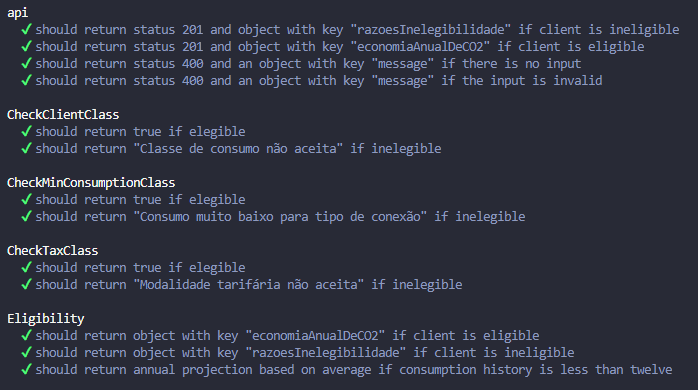
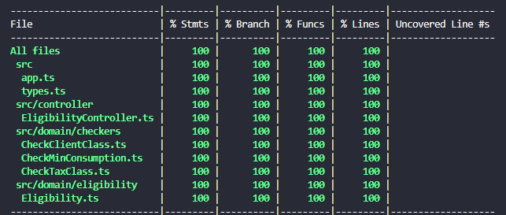

## Backend Case - Elegibilidade de clientes para energia sustentável

<details>
<summary>Solução</summary>

- Lógica de negócio desenvolvida usando POO e TypeScript.
- Realizados testes unitários para cada classe criada.
- Implementada API simples para entrega do resultado de elegibilidade do cliente.
- Adicionados testes de integração.
- É possível visualizar a cobertura de testes.
- Para saber como rodar os testes e cobertura veja a seção ``Testes``
</details>
<br>

<details>
<summary>Como rodar a aplicação</summary>

Clone o repositório:
```
git clone git@github.com:queite/lemon-case.git
```
Entre na pasta raiz:
```
cd lemon-case
```
Instale as depenências:
```
npm install
```
Acesse a branch api:
```
git checkout api
```
Rode a aplicação:
```
npm run dev
```
Teste a rota ``localhost:3000/eligibility`` com Thunder Client (rota e body já disponíveis) ou outra ferramenta de sua preferência.

<br>

<details>
<summary>Formato do body</summary>

**Cliente elegível**
```
{
  "numeroDoDocumento": "14041737706",
  "tipoDeConexao": "bifasico",
  "classeDeConsumo": "comercial",
  "modalidadeTarifaria": "convencional",
  "historicoDeConsumo": [
    3878,
    9760,
    5976,
    2797,
    2481,
    5731,
    7538,
    4392,
    7859,
    4160,
    6941,
    4597
  ]
}
```
**Cliente inelegível**
```
{
  "numeroDoDocumento": "14041737706",
  "tipoDeConexao": "bifasico",
  "classeDeConsumo": "rural",
  "modalidadeTarifaria": "verde",
  "historicoDeConsumo": [
    3878,
    9760,
    5976,
    2797,
    2481,
    5731,
    7538,
    4392,
    7859,
    4160
  ]
}
```
</details>
</details>
<br>

### ⚗️Testes
<details>
<summary>Como rodar os testes</summary>
<br>

Clone o repositório:
```
git clone git@github.com:queite/lemon-case.git
```
Entre na pasta raiz:
```
cd lemon-case
```
Instale as depenências:
```
npm install
```
**⚗️Rodando apenas testes**:
```
npm test
```
**🧪✅Rodando testes com cobertura**:
```
npm run test:coverage
```
</details>
<details>
<summary>Relatório de testes</summary>

**API tests:** <br>


**API coverage:** <br>

</details>
<br>

### 👌Regras de negócio
<details>
<summary>Critérios de Elegibilidade</summary>

- **Classe de consumo do cliente**
    - Possíveis Valores: Comercial, Residencial, Industrial, Poder Público, e Rural.
    - Elegíveis: Comercial, Residencial e Industrial.
- **Modalidade tarifária**
    - Possíveis Valores: Branca, Azul, Verde, e Convencional.
    - Elegíveis: Convencional, Branca.
- **Consumo mínimo do cliente**
    - O cálculo deve ser feito utilizando a média dos 12 valores mais recentes do histórico de consumo.
        - Clientes com tipo de conexão Monofásica só são elegíveis caso tenham consumo médio acima de 400 kWh.
        - Clientes com tipo de conexão Bifásica só são elegíveis caso tenham consumo médio acima de 500 kWh.
        - Clientes com tipo de conexão Trifásica só são elegíveis caso tenham consumo médio acima de 750 kWh.
- Para calcular a projeção da economia anual de CO2, considere que para serem gerados 1000 kWh no Brasil são emitidos em média 84kg de CO2.
- **Subclasse de consumo do cliente**
    - Comercial
        - Elegíveis
            - Administração Condominal
            - Comercial
            - Serviços de Telecomunicação
        - Não elegíveis
            - Templos Religiosos
    - Industrial
        - Elegíveis
            - Industrial
        - Não elegíveis
    - Residencial
        - Elegíveis
            - Residencial
        - Não elegíveis
            - Baixa renda
    - Poder Público
        - Elegíveis
        - Não elegíveis
            - Poder público estadual
            - Poder público municipal
    - Rural
        - Elegíveis
        - Não elegíveis
            - Agropecuária rural
</details>
